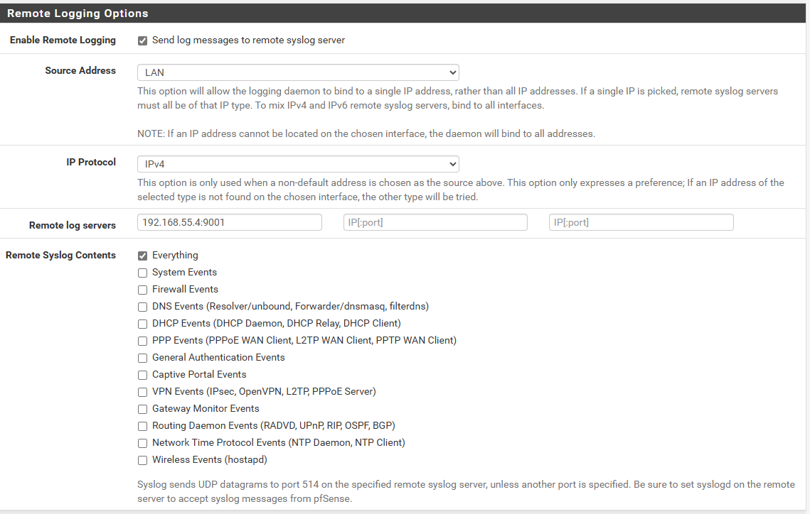
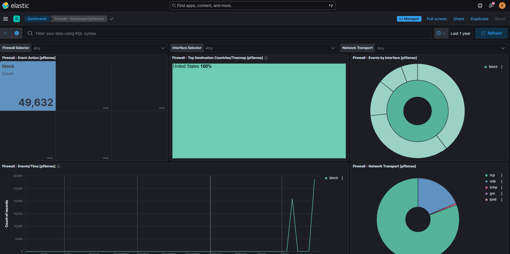

# 🛠️ Log Forwarding to Security Onion

This document describes the configuration process for forwarding external logs from the pfSense firewall to the Security Onion sensor for centralized monitoring and analysis.

---

## 🧰 Deployment Environment

- **Firewall Device**: pfSense 2.7.2 CE
- **Security Onion Host**: Dell OptiPlex 7040, SO version 2.4.141 (Standalone Mode)
- **Log Forwarding Protocol**: Syslog on UDP port 9001 (default for pfSense integration)
- **Monitoring Tools**: Elasticsearch, Logstash, Kibana (ELK Stack)

---

## 📦 Integration and Configuration Steps

1. **Add the pfSense Integration in Elastic Fleet**

- Access Security Onion’s Kibana interface and navigate to Elastic Fleet > Agent Policies.
- Select the target policy (e.g., so-grid-nodes_general).
- Click Add integration and search for pfSense.
- Select the pfSense integration and follow the on-screen instructions.

2. **Configure pfSense to Send Logs**

- The integration expects logs on UDP port 9001 by default.
- Configure pfSense to forward syslog logs to Security Onion’s management IP at port 9001.

3. **Update pfSense Integration Settings**

- Back in Elastic Fleet, edit the pfSense integration settings.
- Change the Syslog Host field from localhost to 0.0.0.0 to allow listening on all interfaces.
- Save and deploy the changes.

4. **Adjust Security Onion Firewall Rules**

- Navigate to Administration > Configuration in Security Onion’s interface.
- Enable Show advanced settings from the Options menu.
- Under Firewall > Hostgroups, add the pfSense firewall IP to customhostgroup0 (or next available group).
- Under Firewall > Portgroups, add UDP port 9001 to customportgroup0 (or next available group).
- Assign these groups to the firewall role responsible for receiving pfSense logs under the INPUT chain.
- Click SYNCHRONIZE GRID to apply the new rules immediately.

5. **Verify Logs in Security Onion Dashboards**

- Access the Firewall dashboard in Kibana to view incoming pfSense logs.
- Confirm that logs are being received and parsed correctly.

---

## 🧩 Challenges Encountered
❗ UDP syslog packets were initially blocked by internal firewall rules — resolved by allowing UDP 514 traffic on SO management interface.

❗ Log timestamps appeared incorrect — synchronized clocks on pfSense and Security Onion via NTP.

---

📸 Screenshots
pfSense Remote Syslog Configuration

Kibana Dashboard Showing pfSense Logs

---

## ✅ Summary

Log forwarding from pfSense to Security Onion was successfully implemented to centralize firewall and system logs. This enhances visibility into network security events and supports correlation with IDS alerts and other log sources.